# SYBO Assignment - Ninja Spoilers

Ninja Spoilers - A game developed by friend of mine, and he is confident it will go viral and blow all other games out of the water. He has very kindly asked me to develop the
backend for this.

# Backend api contracts:
HTTP Method| Resource |
---   | --- | 
POST  | /ninjaSpoilers/api/v1/user
GET   | /ninjaSpoilers/api/v1/users
PUT   | /ninjaSpoilers/api/v1/user/{userId}/state
GET   | /ninjaSpoilers/api/v1/user/{userId}/state
PUT   | /ninjaSpoilers/api/v1/user/{userId}/friends
GET   | /ninjaSpoilers/api/v1/user/{userId}/friends

Endpoint - "https://evv5qsaiwh.execute-api.us-east-1.amazonaws.com/dev"

# Task:

Create API's to implement below features for the Ninja Spoilers game,
* Create user
* Save Game state
* Load Game state
* Update friends
* Get friends
* Get all users

# Tech stacks used:


Languages/Frameworks| Version |
--- | --- | 
Python | 3.8 |
Serverless | 2.43.1
AWS Lambda| Python runtime
DynamoDB | NA

# Approach Followed:

  * Created individual classes for each of the services implemented
  * One common manager class created to invoke the services from the handler
  
# DynamoDB's table screenshots

**Users**:

<p align="center">
  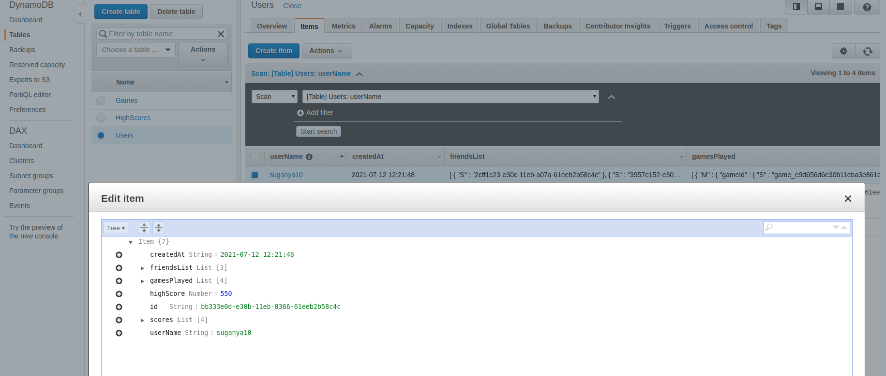
</p>

**Games**:

<p align="center">
  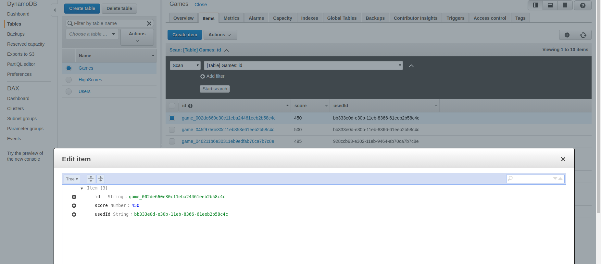
</p>

**HighScore**:

<p align="center">
  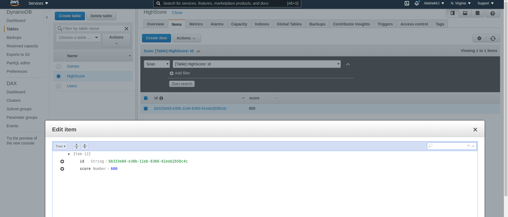
</p>

# POSTMAN screenshot:

**Postman collection** - https://www.getpostman.com/collections/4472dc5f4078102e5fda

**Create User**:

<p align="center">
  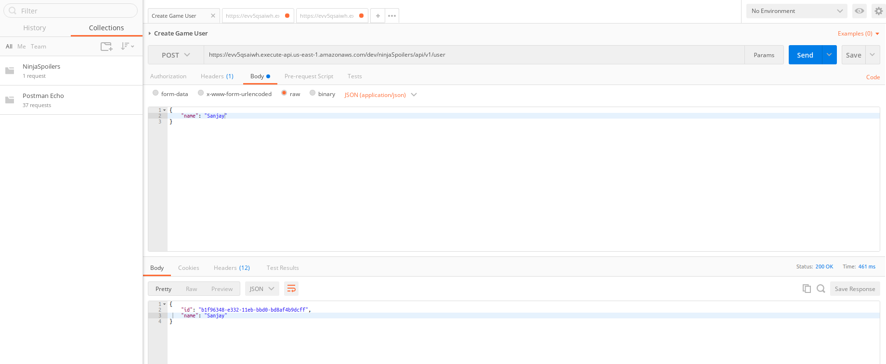
</p>

**Save Game State**:

<p align="center">
  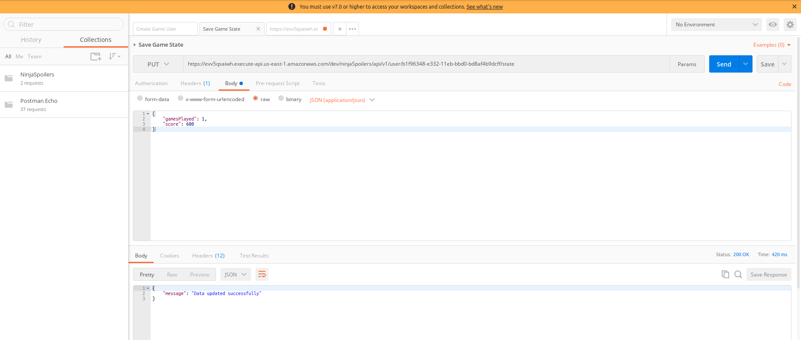
</p>

**Load Game State**:

<p align="center">
  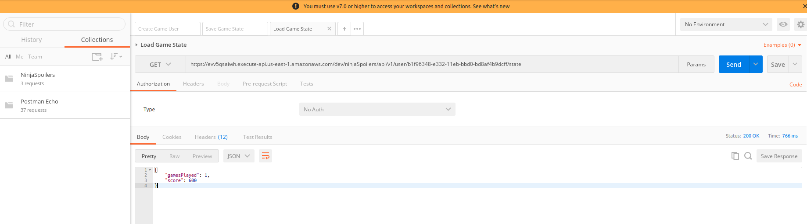
</p>

**Update User Friends**:

<p align="center">
  
</p>

**Get User Friends**:

<p align="center">
  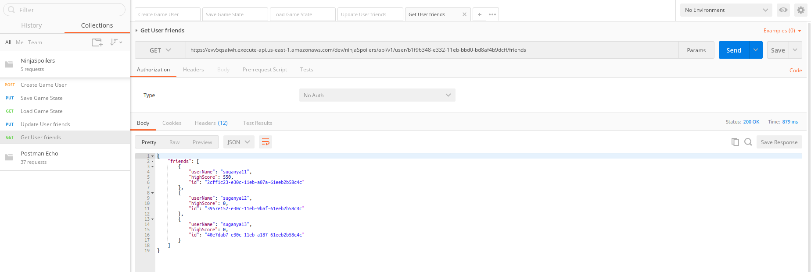
</p>

**Get All Users**:

<p align="center">
  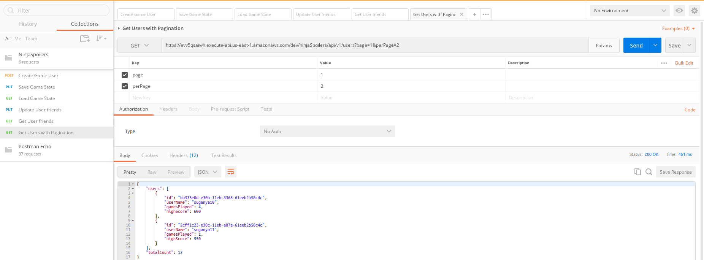
</p>

# Python code to access the endpoint:
```python
import requests
url = "https://evv5qsaiwh.execute-api.us-east-1.amazonaws.com/dev/ninjaSpoilers/api/v1/user/b1f96348-e332-11eb-bbd0-bd8af4b9dcff/state"
headers = {
    'cache-control': "no-cache",
    'postman-token': "30021cd8-9449-7b4e-c630-883c72320aae"
    }
response = requests.request("GET", url, headers=headers)
print(response.text)
```

# Python modules used:

Below are the modules installed in python using pip for the execution,

Modules| Version |
--- | --- | 
boto3 | 1.17.108 |
botocore | 1.20.108

# Documentation:

* Written python program to convert open api swagger yaml file to html file for the api documentation purpose.
* Documentation contains api details, success response and error responses
* Folder documentation has the yaml file and html file for the api documentation

# Documentation screenshot:

Overall API's:

<p align="center">
  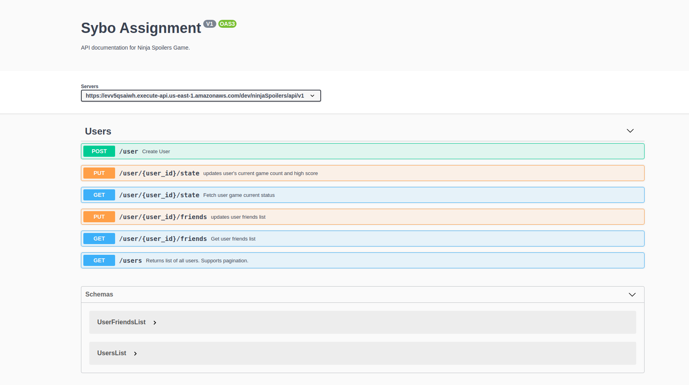
</p>

Create User:

<p align="center">
  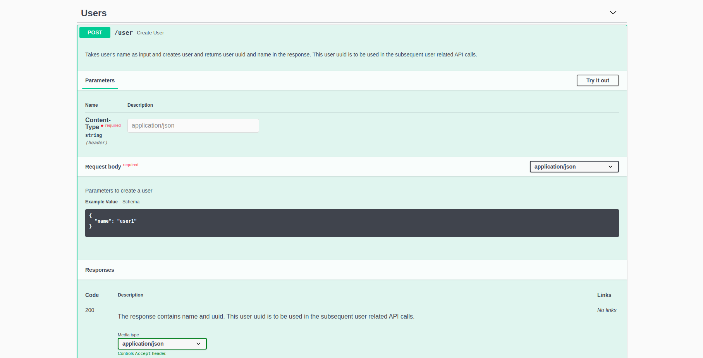
</p>

<p align="center">
  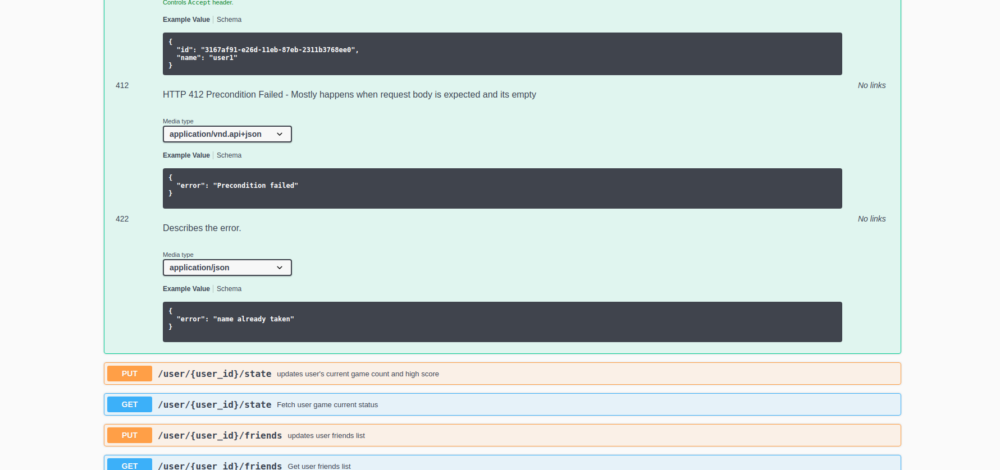
</p>

# Code Coverage and Unit Tests

* Written separate unit test cases for each of the api functions
* Utilized **Coverage** module to identify the code coverage of all services for the games
* Overall coverage of **90%** achieved
* Individual coverage details of the modules are available inside the coverage_html folder as html files.

<p align="center">
  
</p>

<p align="center">
  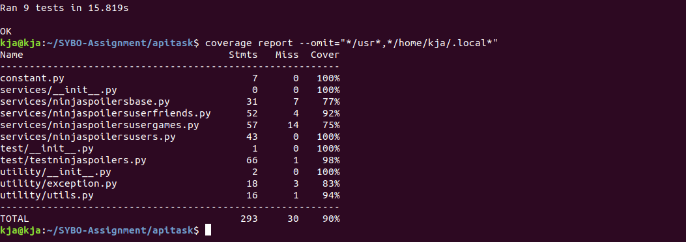
</p>

<p align="center">
  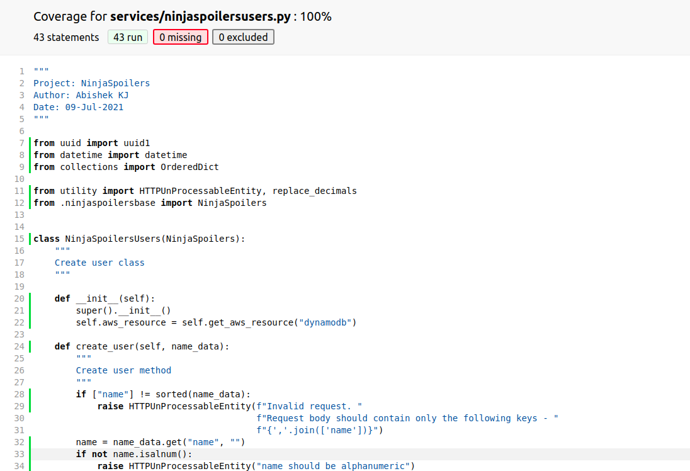
</p>

# Code Quality Standards using Pylint:
Pylint is a source-code, bug and quality checker for the Python programming language
* Utilized Pylint module to check the code quality standards for python
* Overall quality of **8.62/10** achieved

<p align="center">
  
</p>

<p align="center">
  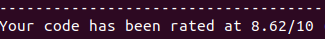
</p>

# Performance and Load testing using Locust framework:


# Prerequisite for running serverless:

Please follow below links to set up serverless and aws profile in the local linux machine,

* https://www.serverless.com/framework/docs/providers/aws/guide/installation/
* https://www.serverless.com/framework/docs/providers/aws/guide/credentials/
 

# Why SERVERLESS Framework and AWS Lambda:

**AWS LAMBDA**:

* AWS Lambda creates an instance of the function and runs its handler method to process the event. When the function returns a response, it stays active and waits to process additional events. If you invoke the function again while the first event is being processed, Lambda initializes another instance, and the function processes the two events concurrently. As more events come in, Lambda routes them to available instances and creates new instances as needed. When the number of requests decreases, Lambda stops unused instances to free up scaling capacity for other functions.

* Your functions' concurrency is the number of instances that serve requests at a given time. For an initial burst of traffic, your functions' cumulative concurrency in a Region can reach an initial level of between 500 and 3000, which varies per Region. Note that the burst concurrency quota is not per-function; it applies to all of your functions in the Region.

**Horizontal Scaling**:
* AWS Lambda Platform creates new instances to handle concurrent requests

**Vertical Scaling**:
* AWS Lambda also has a rudimentary vertical scaling option, however, in its memory configuration* Lambda functions can be configured (manually) to have from 128MB to 1.5GB of RAM, and the CPU performance capability of a Lambda function scales ‘roughly proportionally’ with the memory setting.
* In other words you may see a 12X CPU performance improvement going from 128MB to 1.5GB RAM configuration.
* Network I/O ability also scales with RAM.

**Burst concurrency quotas**

* 3000 – US West (Oregon), US East (N. Virginia), Europe (Ireland)
* 1000 – Asia Pacific (Tokyo), Europe (Frankfurt), US East (Ohio)
* 500 – Other Regions

So AWS lambda takes care of serving multiple requests at a time  and also we can use thread pools to multi thread the function calls for better performance

**SERVERLESS**:

* Serverless Framework is an open source project and popular choice for many Amazon Web Services (AWS) customers who wish to quickly construct and deploy serverless applications using services like AWS Lambda and Amazon API Gateway.
* For developers and operations professionals, Serverless Framework builds, packages, and deploys code with one simple command: serverless deploy.
* Serverless Framework is open source software that builds, compiles, and packages code for serverless deployment, and then deploys the package to the cloud.
* With Python on AWS, for example, Serverless Framework creates the self-contained Python environment, including all dependencies. Then, it packages that environment into the standardized zip file for AWS Lambda and creates all of the associated AWS resources required for deployment in an AWS CloudFormation template.
* Finally, it copies the code to AWS and initiates the CloudFormation stack creation or update, which provisions AWS services for the serverless application.
* Serverless Framework does this by providing an event queue into which a combination of standard provided packages and templates can be combined with additional open source plugins to expand the functionality.
* This event queue allows plugin developers to create hooks and alter the behaviors and outputs of each stage of the process (e.g. build, compile, package, provision, and deploy).
